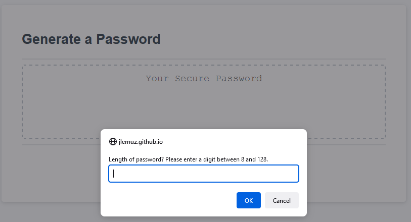
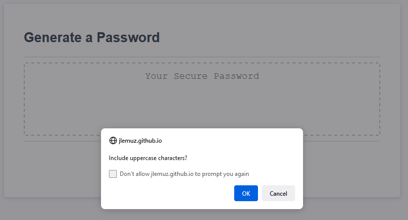
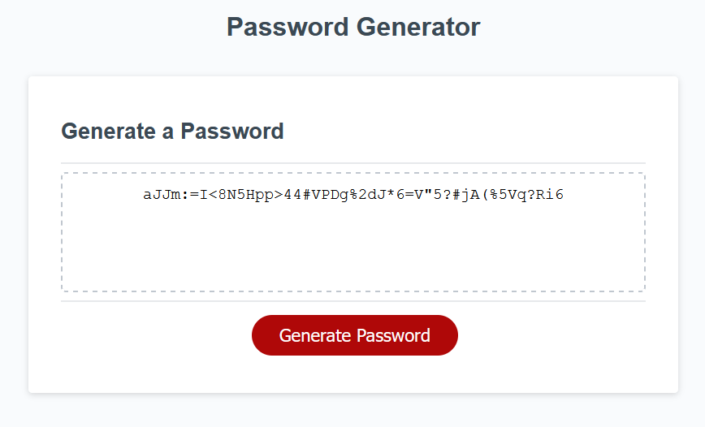

# Random Password Generator Challenge  🔐💻

## Description 
The purpose of this challenge was to create a program that generates a random password based on the parameters requested by the user. There will be prompts and confirm boxes asking the user the length of the password as well as what type of characters to include.

## Logic Implemented 👨‍🔬

For this project, the main ideas were using different types of loops, arrays, array methods, and function calls. Do-while loops were used to ensure that the prompt would reattempt if a letter or number outside of the range was entered. Additionally, for loops were used to loop through the filtered array of functions in order to include certain characters. Finally, the filter array method was used to filter out functions based on the user input and the map method created an array of the filtered functions.

## Screenshots

### 1. When the Generate Password button is clicked, there is a prompt for the length:
 

### 2. Then there is a series of confirm boxes for the types of characters to include:

### 3. Finally, after all the prompts are selected the password is generated. In this case, the user requested a 45 character length password with all special characters:  
  

## Deployed Link 🎉
https://jlemuz.github.io/safest-password-generator/
